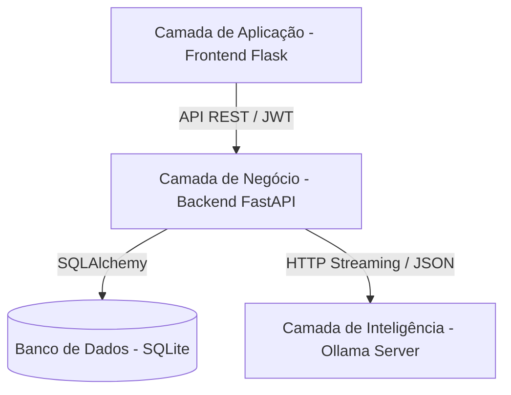

# Documentação Técnica - QA AI Platform

Este documento detalha os requisitos, arquitetura e implementação da plataforma **QA AI Platform**, uma solução de Q&A (Perguntas e Respostas) baseada em inteligência artificial generativa (Modelos LLM) local.

## 1. Requisitos Funcionais (RF)

Os requisitos funcionais descrevem as funcionalidades diretas oferecidas ao usuário final:

*   **RF01 - Autenticação de Usuários**: O sistema permite que novos usuários se registrem e usuários existentes façam login utilizando credenciais seguras.
*   **RF02 - Interface de Chat**: O usuário pode enviar perguntas em texto para o modelo de linguagem e receber respostas formatadas em Markdown.
*   **RF03 - Histórico de Conversas**: Todas as interações são salvas por usuário, permitindo navegar por conversas anteriores na barra lateral.
*   **RF04 - Streaming de Respostas (SSE)**: O usuário pode optar por receber a resposta em tempo real (palavra por palavra) via Server-Sent Events.
*   **RF05 - Configurações de Interface**: O sistema oferece alternância entre temas (Claro/Escuro) e ativação/desativação do modo streaming.
*   **RF06 - Identificação Dinâmica do Modelo**: A interface exibe dinamicamente qual modelo LLM está sendo executado no servidor backend.
*   **RF07 - Isolamento de Dados**: Cada usuário visualiza apenas seu próprio histórico de conversas.

## 2. Requisitos Não Funcionais (RNF)

Os requisitos não funcionais definem as qualidades e restrições do sistema:

*   **RNF01 - Segurança**: As senhas são armazenadas utilizando o algoritmo de hashing `bcrypt`. A sessão é gerenciada via tokens JWT (JSON Web Tokens).
*   **RNF02 - Privacidade**: O processamento de IA é realizado localmente através do serviço Ollama, garantindo que os dados não saiam da infraestrutura controlada pelo usuário.
*   **RNF03 - Performance**: O uso de FastAPI (assíncrono) no backend e a implementação de streaming garantem baixa latência percebida pelo usuário.
*   **RNF04 - Responsividade**: A interface utiliza Bootstrap 5 para garantir uma experiência consistente em dispositivos móveis e desktops.
*   **RNF05 - Persistência**: Utilização de banco de dados relacional SQLite para armazenamento eficiente e de baixa configuração.
*   **RNF06 - Auditoria**: O backend implementa middlewares de logging que registram o método, caminho, status e duração de cada requisição.

## 3. Arquitetura do Sistema

O sistema segue uma arquitetura de três camadas distribuídas, focada na separação de responsabilidades:

*   **Frontend (UI)**: Atua como um servidor de templates e ativos estáticos. A lógica de interação reside em scripts JavaScript nativos (Vanilla JS) que consomem a API.
*   **Backend (API)**: Centraliza as regras de negócio, autenticação e orquestração. É o "cérebro" que coordena os pedidos do usuário e as respostas da IA.
*   **Inteligência (Ollama)**: Serviço independente que executa modelos LLM (como Qwen3) e fornece uma interface de geração de texto.

## 4. Stack Tecnológica

### Backend (Python/FastAPI)
*   **FastAPI**: Framework web moderno e de alta performance.
*   **SQLAlchemy**: ORM para manipulação do banco de dados relacional.
*   **Pydantic**: Validação de dados e gestão de configurações.
*   **Passlib/Bcrypt**: Segurança e hashing de senhas.
*   **PyJWT**: Geração e validação de tokens de autenticação.
*   **HTTPX**: Cliente HTTP assíncrono para comunicação com o Ollama.

### Frontend (Python/Flask + Web Stack)
*   **Flask**: Utilizado para roteamento de páginas e servir arquivos estáticos.
*   **Vanilla JavaScript**: Lógica de cliente sem frameworks pesados, garantindo velocidade.
*   **Bootstrap 5**: Framework CSS para layout e componentes modernos.
*   **Bootstrap Icons**: Biblioteca de ícones vetoriais.
*   **Marked.js**: Biblioteca do lado do cliente para converter Markdown em HTML.

### Inteligência e Dados
*   **Ollama**: Plataforma de execução de modelos LLM locais.
*   **SQLite**: Banco de dados em arquivo, ideal para protótipos e uso pessoal/edge.

## 5. Detalhamento de Funcionalidades

### Frontend (UI)
A interface foi projetada para ser minimalista e funcional. O sistema de temas é controlado via atributos de dados no HTML e persiste através do `localStorage`. A comunicação com a API utiliza o padrão `fetch` com cabeçalhos de autorização `Bearer Token`. Para o streaming, utiliza-se a API `ReadableStream` para iterar sobre os chunks SSE e atualizar o DOM em tempo real.

### Backend (API)
O backend é estruturado em módulos:
*   **Endpoints**: Rotas divididas por domínio (`auth`, `chat`, `users`).
*   **Services**: Abstração da lógica de persistência e comunicação externa.
*   **Core**: Configurações centralizadas via variáveis de ambiente (`.env`) e tratamento global de exceções.

### Integração com Ollama
A integração ocorre via chamadas HTTP POST para o endpoint `/api/generate`. O backend atua como um proxy inteligente:
1.  Recebe a pergunta do usuário.
2.  Extrai o contexto se necessário.
3.  Decide se a resposta será via stream ou JSON único com base na preferência do usuário.
4.  Se for stream, abre uma conexão persistente e converte os chunks do Ollama para o padrão Server-Sent Events (SSE) antes de enviar ao frontend.
5.  Ao finalizar, captura a resposta completa para fins de persistência no histórico.

## 6. Conclusão

A **QA AI Platform** demonstra como é possível construir uma aplicação robusta, segura e privada utilizando tecnologias modernas de IA local. A separação em camadas permite escalabilidade e facilidade de manutenção, enquanto a stack tecnológica escolhida equilibra performance e simplicidade de desenvolvimento.
